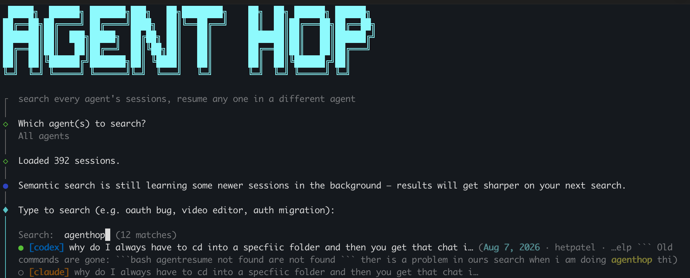

<p align="center">
  
</p>

**Search all your coding-agent chats, then resume any session in any agent.**

# agent-hop

Your best coding-agent context is probably trapped in the wrong tool.

`agent-hop` searches your local Claude Code, Codex, OpenCode, Pi, and Grok
Build sessions from one picker, then resumes the selected chat in the original
agent or converts it into another agent's native session format.

Why use it:

- **Stop hunting through project folders** — search every supported agent's
  local history from one command.
- **Stop re-explaining context** — resume with the real conversation history,
  not a summary.
- **Switch agents without starting over** — hop a Codex chat into OpenCode,
  Claude Code into Codex, Grok into Pi, and more.
- **Use it interactively or from scripts** — humans get a picker; agents can
  call the deterministic non-interactive mode.

Use it when you remember the topic, but not the tool, project directory, or
exact session.

## Install

```bash
npm install -g agent-hop
```

Or with Bun, if you already use it:

```bash
bun install -g agent-hop
```

## Usage

```bash
agent-hop
```

or the short alias:

```bash
ah
```

Walks you through:

1. **Which agent(s) to search?** — all five, or restrict to one
2. **Search for:** — hybrid search across local session history
3. **Pick a session** — list with tool, title, date, project, and context preview
4. **Resume in which agent?** — defaults to the same tool (native resume), or
   pick a different one to convert into that tool's format first
5. Launches you directly into the resumed session

Non-interactive / scriptable form:

```bash
agent-hop "auth migration" --agent claude --resume-in codex
```

| Flag | Description |
|---|---|
| `-a, --agent <tool>` | Restrict search to one agent |
| `-r, --resume-in <tool>` | Resume the picked session in this agent (default: same tool) |

### Agent/script mode

Agents should avoid the interactive picker. Use the explicit form:

```bash
ah "<specific query>" --agent <source-agent> --resume-in <target-agent>
```

Example:

```bash
ah "adobe premiere mcp setup" --agent codex --resume-in opencode
```

In non-interactive mode, `agent-hop` automatically chooses the top-ranked
session instead of asking you to pick one. Use a specific query and `--agent`
whenever possible; vague queries like `"adobe"` may resume the wrong chat.

## Why it exists

Agent sessions are local, useful, and fragmented.

Each CLI stores its own history in its own shape. Claude Code cannot naturally
resume a Codex thread. Codex cannot naturally pick up an OpenCode session.
And when you are trying to find "that one chat where we debugged the auth
flow," the built-in resume pickers usually only search one tool, one project,
or one narrow session store.

`agent-hop` makes your local agent history feel like one searchable workspace:

- find the right thread without remembering which project directory it came from
- continue in the original agent when that is what you want
- hop the same conversation into a different agent when that agent is better for
  the next step
- preserve the actual conversation history, not a generated summary

## Supported agents

| Agent | Same-tool resume | Cross-tool resume (write into this format) |
|---|---|---|
| Claude Code | ✅ | ✅ |
| Codex | ✅ | ✅ |
| OpenCode | ✅ | ✅ |
| Pi | ✅ | ✅ |
| Grok Build | ✅ | ✅ |

Every adapter has been verified with a real live model call actually
recalling injected content across a resume.

Muse Code support was removed for now — the write/resume path needs live
Muse API access to verify correctly, which isn't available here. May come
back once that's testable end-to-end.

## How it works

`agent-hop` has two layers:

1. A **search layer** that indexes the local session stores from each supported
   agent.
2. A **handoff layer** that converts the selected conversation into the target
   agent's native session format, then replaces the current process with that
   agent's real resume command.

No cloud sync is required. It reads the same local files the agents themselves
write.

### Search architecture

Search is designed to feel instant while still catching non-literal matches:

- **Stage 1: lexical search, every keystroke.** BM25 scores the local sessions
  immediately. Exact phrase matches are prioritized, fuzzy typo matching handles
  small misspellings, prefix matching catches cases like `ux` -> `uxp`, and a
  recency multiplier makes recent exact matches easier to find.
- **Stage 2: semantic refine, after you pause typing.** A small local MiniLM
  embedding model (`all-MiniLM-L6-v2`, via `onnxruntime-web`) refines the ranking
  against a cached vector index. The corpus is indexed in the background so
  search never blocks on a full rebuild.
- **No native dependency required.** The embedding runtime uses WASM, so the npm
  package stays portable and avoids native ONNX install friction.

The vector index lives under `~/.agent-hop/` and updates incrementally. New or
changed sessions are indexed in the background; already-indexed sessions are
reused.

### Handoff architecture

Each tool stores sessions on disk in its own format — some as flat JSONL
files, some behind an official export/import CLI, and some with separate
display/replay event streams. `agent-hop` normalizes all of them to one shape:

```ts
interface Turn { role: "user" | "assistant"; text: string }
```

Each adapter (`src/adapters/<tool>.ts`) implements:

- `listSessions()` — cheap metadata scan for search
- `read(ref)` — full conversation → `Turn[]`
- `write(turns, projectPath)` — `Turn[]` → a new session in that tool's
  native format, indistinguishable from one the tool created itself
- `resumeCmd(sessionId, projectPath)` — the actual command to exec into

Adding a new agent means writing one new adapter file; nothing else changes.

### Per-tool notes

- **Claude Code**: raw JSONL under `~/.claude/projects/<encoded-cwd>/`. The
  directory name replaces *every* non-alphanumeric character with `-` (not
  just `/`) — a real gotcha if you don't match it exactly.
- **Codex**: raw JSONL rollout files under `~/.codex/sessions/YYYY/MM/DD/`.
  `response_item` entries let Codex continue the conversation; `event_msg`
  entries are also written so the TUI visibly replays prior turns.
- **OpenCode**: uses the official `opencode export`/`opencode import`
  commands rather than writing to its SQLite store directly. Message/part IDs
  must be genuinely unique per session — OpenCode's schema uses them as
  primary keys with `onConflictDoNothing()`, so a repeated ID silently no-ops
  the insert with zero visible error.
- **Pi**: JSONL under `~/.pi/agent/sessions/--<encoded-cwd>--/`. Unlike
  Claude, Pi only replaces `/`, leaving `_` and `.` in path components intact.
- **Grok Build**: `chat_history.jsonl` + `summary.json` per session, directory
  keyed by URL-encoded cwd. `updates.jsonl` is also written so Grok's TUI can
  render the previous chat history, not just continue from it invisibly.

### Launch behavior

On Unix-like systems, `agent-hop` uses true process replacement (`execve`) for
the final launch when possible. That means once the target agent starts, there
is no parent `agent-hop` process left holding the terminal. This keeps raw TTY
input responsive for interactive agents like OpenCode and Pi.

## Development

```bash
git clone https://github.com/hetpatel-11/agent-hop.git
cd agent-hop
npm install
npm run build
npm link   # makes `agent-hop` available globally, pointing at your local build
```

`npm run dev` runs the CLI directly via `tsx`, no build step needed.
